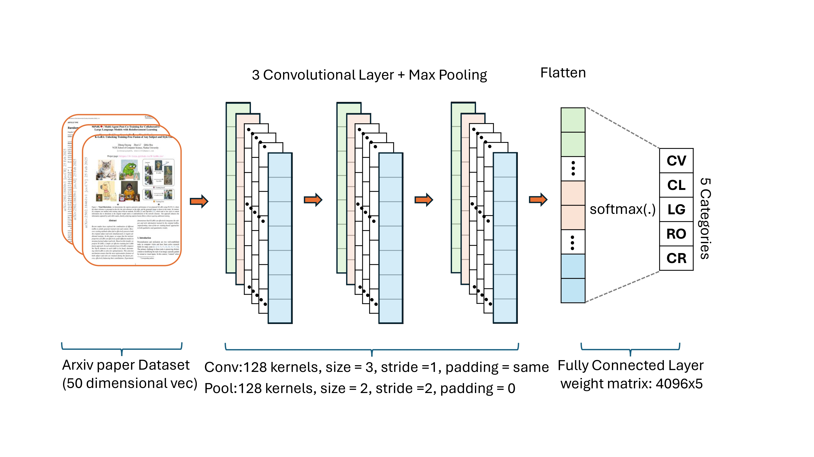
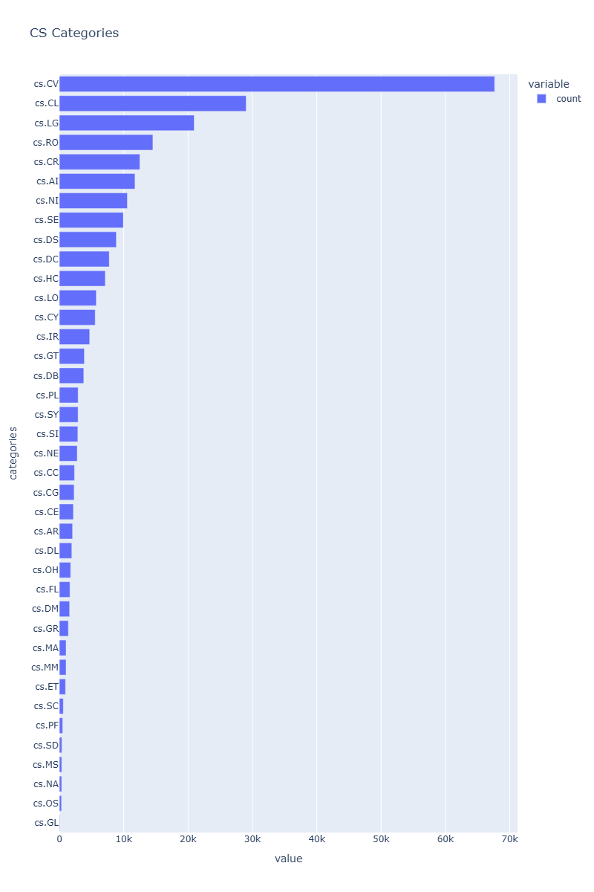
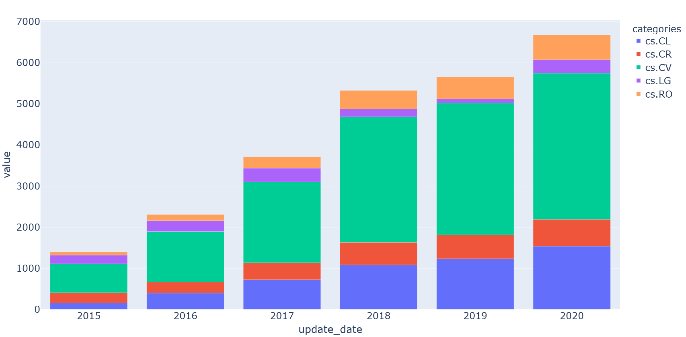
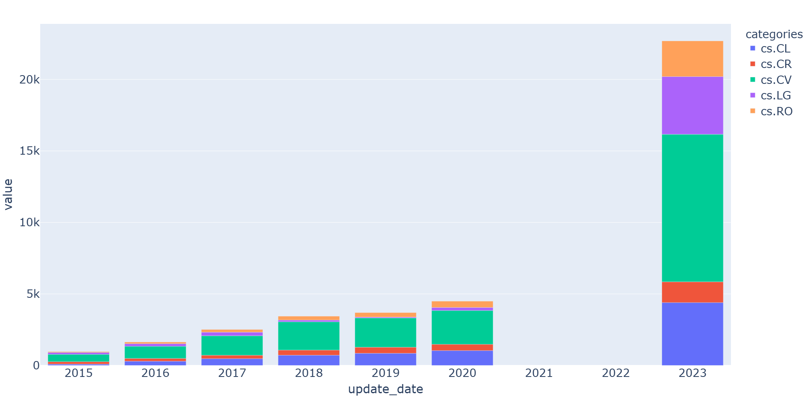
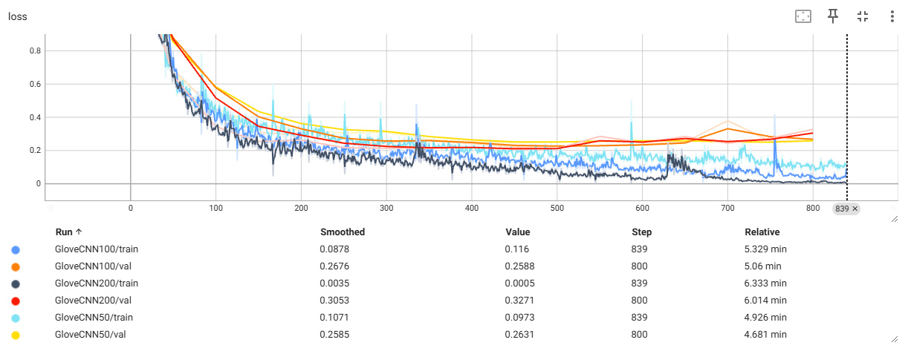
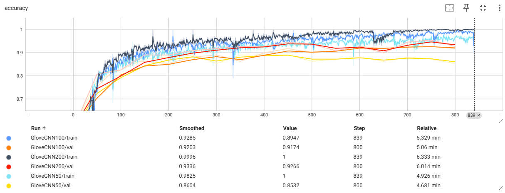
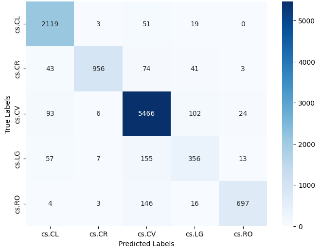
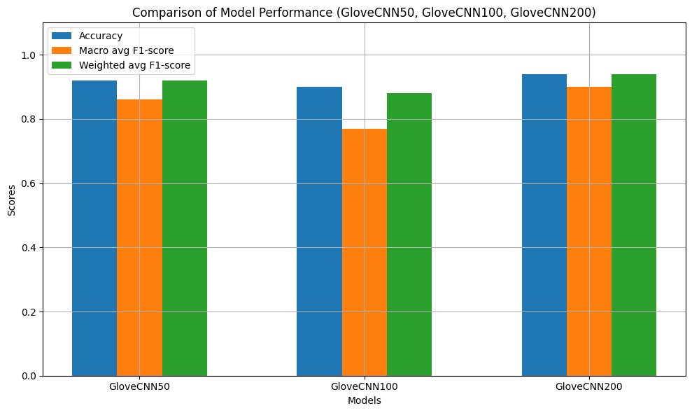

<h1 align="center">🤖 ArXiv Paper Classification using CNN and Glove Embeddings</h1>

<!--  -->

 

👉 CSE 587: Deep Learning for NLP - Midterm Project (Spring 2025)

👉 **Contributors**: `Sinjoy Saha`, `Xin Dong`

👉 Read the full report [here](#).

## 🔍Table of Contents

- [🔍Table of Contents](#table-of-contents)
- [Dataset Curation](#dataset-curation)
  - [Dataset Distribution](#dataset-distribution)
    - [OOD Test Data](#ood-test-data)
- [Models](#models)
  - [Model Architecture](#model-architecture)
  - [Model Parameters](#model-parameters)
  - [Resource Size (MB)](#resource-size-mb)
- [Results](#results)
    - [Training and validation loss curves for GloveCNN models with embedding dimensions 50, 100 and 200.](#training-and-validation-loss-curves-for-glovecnn-models-with-embedding-dimensions-50-100-and-200)
    - [Training and validation accuracy curves for GloveCNN models with embedding dimensions 50, 100 and 200.](#training-and-validation-accuracy-curves-for-glovecnn-models-with-embedding-dimensions-50-100-and-200)
  - [Confusion Matrix for Glove50CNN for 2015-2020 and 2023](#confusion-matrix-for-glove50cnn-for-2015-2020-and-2023)
  - [Performance of Glove50CNN (2015-2020)](#performance-of-glove50cnn-2015-2020)
  - [Performance of Glove50CNN (2023)](#performance-of-glove50cnn-2023)
- [Discussion](#discussion)
  - [Impact of Embedding Size on Model Performance](#impact-of-embedding-size-on-model-performance)
- [Conclusion](#conclusion)

## Dataset Curation

        

We curate the top-5 classes from arXiv CS papers.

| Category                          | Papers  | Percentage |
| --------------------------------- | ------- | ---------- |
| cs.CV (Computer Vision)           | 112,317 | 34.76%     |
| cs.CL (Computation and Language)  | 59,447  | 18.4%      |
| cs.LG (Machine Learning)          | 99,416  | 30.77%     |
| cs.RO (Robotics)                  | 27,966  | 8.65%      |
| cs.CR (Cryptography and Security) | 24,961  | 7.72%      |

sdfsd fs

### Dataset Distribution

#### OOD Test Data

## Models

### Model Architecture

| Layer Type                   | Output Shape    | Glove50CNN Parameters | Glove100CNN Parameters | Glove200CNN Parameters |
| ---------------------------- | --------------- | --------------------- | ---------------------- | ---------------------- |
| Embedding                    | [512, 256, 50]  | 20,000,000            | 40,000,000             | 80,000,000             |
| Conv1d (In → Out, kernel=3)  | [512, 128, 256] | 19,328                | 38,528                 | 76,928                 |
| MaxPool1d (kernel=2)         | [512, 128, 128] | 0                     | 0                      | 0                      |
| Conv1d (128 → 128, kernel=3) | [512, 128, 128] | 49,280                | 49,280                 | 49,280                 |
| MaxPool1d (kernel=2)         | [512, 128, 64]  | 0                     | 0                      | 0                      |
| Conv1d (128 → 128, kernel=3) | [512, 128, 64]  | 49,280                | 49,280                 | 49,280                 |
| MaxPool1d (kernel=2)         | [512, 128, 32]  | 0                     | 0                      | 0                      |
| Fully Connected (Linear)     | [512, 5]        | 20,485                | 20,485                 | 20,485                 |

### Model Parameters

| Parameter Type               | Glove50CNN | Glove100CNN | Glove200CNN |
| ---------------------------- | ---------- | ----------- | ----------- |
| **Total Parameters**         | 20,138,373 | 40,157,573  | 80,195,973  |
| **Trainable Parameters**     | 138,373    | 157,573     | 195,973     |
| **Non-trainable Parameters** | 20,000,000 | 40,000,000  | 80,000,000  |

### Resource Size (MB)

| Resource                 | Glove50CNN | Glove100CNN | Glove200CNN |
| ------------------------ | ---------- | ----------- | ----------- |
| Input Size for one batch | 0.50       | 0.50        | 0.50        |
| Forward/Backward Pass    | 386.02     | 436.02      | 536.02      |
| Parameters Size          | 76.82      | 153.19      | 305.92      |
| **Estimated Total Size** | **463.34** | **589.71**  | **842.44**  |

## Results

#### Training and validation loss curves for GloveCNN models with embedding dimensions 50, 100 and 200.

#### Training and validation accuracy curves for GloveCNN models with embedding dimensions 50, 100 and 200.

---

### Confusion Matrix for Glove50CNN for 2015-2020 and 2023

### Performance of Glove50CNN (2015-2020)

| Class        | Precision | Recall   | F1-score | Count |
| ------------ | --------- | -------- | -------- | ----- |
| cs.CL        | 0.91      | 0.97     | 0.94     | 4396  |
| cs.CR        | 0.98      | 0.86     | 0.91     | 1450  |
| cs.CV        | 0.93      | 0.96     | 0.94     | 10316 |
| cs.LG        | 0.67      | 0.61     | 0.63     | 4038  |
| cs.RO        | 0.95      | 0.80     | 0.87     | 2495  |
| **Accuracy** |           |          | **0.92** |       |
| **M Avg**    | **0.89**  | **0.84** | **0.86** |       |
| **W Avg**    | **0.92**  | **0.92** | **0.92** |       |

### Performance of Glove50CNN (2023)

| Class        | Precision | Recall   | F1-score | Count |
| ------------ | --------- | -------- | -------- | ----- |
| cs.CL        | 0.80      | 0.96     | 0.87     | 4396  |
| cs.CR        | 0.92      | 0.79     | 0.85     | 1450  |
| cs.CV        | 0.82      | 0.95     | 0.88     | 10316 |
| cs.LG        | 0.89      | 0.49     | 0.63     | 4038  |
| cs.RO        | 0.95      | 0.78     | 0.86     | 2495  |
| **Accuracy** |           |          | **0.84** |       |
| **M Avg**    | **0.88**  | **0.79** | **0.82** |       |
| **W Avg**    | **0.85**  | **0.84** | **0.83** |       |

## Discussion

### Impact of Embedding Size on Model Performance

## Conclusion

**Objective**: Evaluated GloVe-CNN models with embedding sizes of 50, 100, and 200 for research paper classification.

**Findings**:
  - Larger embeddings generally improve accuracy and F1-scores.
  - **GloVe200CNN** performed best, particularly in macro and weighted-average F1 scores.
  - Diminishing returns observed from 100 to 200 dimensions.

**Performance on 2023 Data**:
  - All models showed performance degradation.
  - **cs.LG** had the biggest decline due to evolving research trends.
  - **GloVe200CNN** was most stable, while others struggled with underrepresented categories.

**Key Insights**:
  - Well-represented categories (cs.CL, cs.CR, cs.CV) were more robust.
  - Class distribution impacts model performance over time.

**Future Work**:
  - Train domain-specific word embeddings.
  - Explore hybrid CNN-RNN architectures.
  - Integrate large language models (LLMs) for better accuracy and granularity.