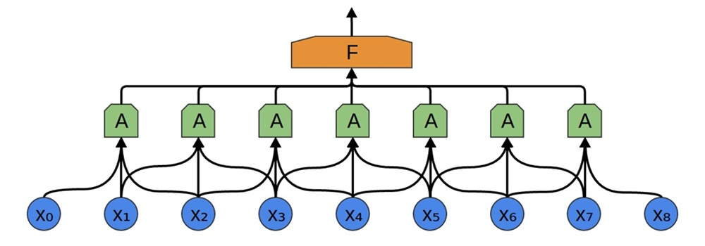
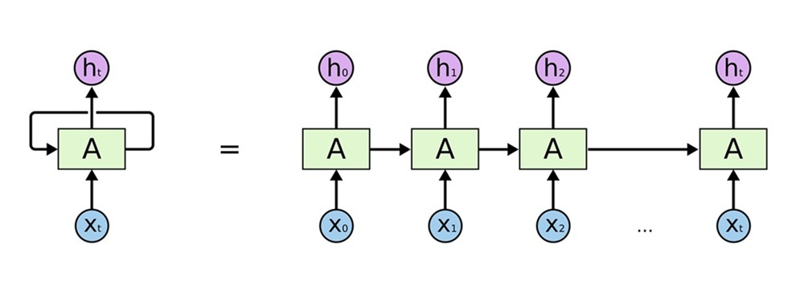

<h1 align="center">🤖 CNN vs RNN for NLP Tasks</h1>

 

👉 CSE 587: Deep Learning for NLP - Midterm Project (Spring 2025)

👉 **Contributors**: `Sinjoy Saha`, `Xin Dong`

👉 Read the full report [here](#).

## 🔍Table of Contents

* [Abstract](#abstract)
* [Problem Definition](#problem-definition)
* [Dataset Curation](#dataset-curation)
* [Method](#method)
  * [Word Embeddings](#word-embeddings)
  * [Model](#model)
  * [Training Details](#training-details)
* [Results](#results)
* [Conclusion](#conclusion)
* [Contact](#contact)